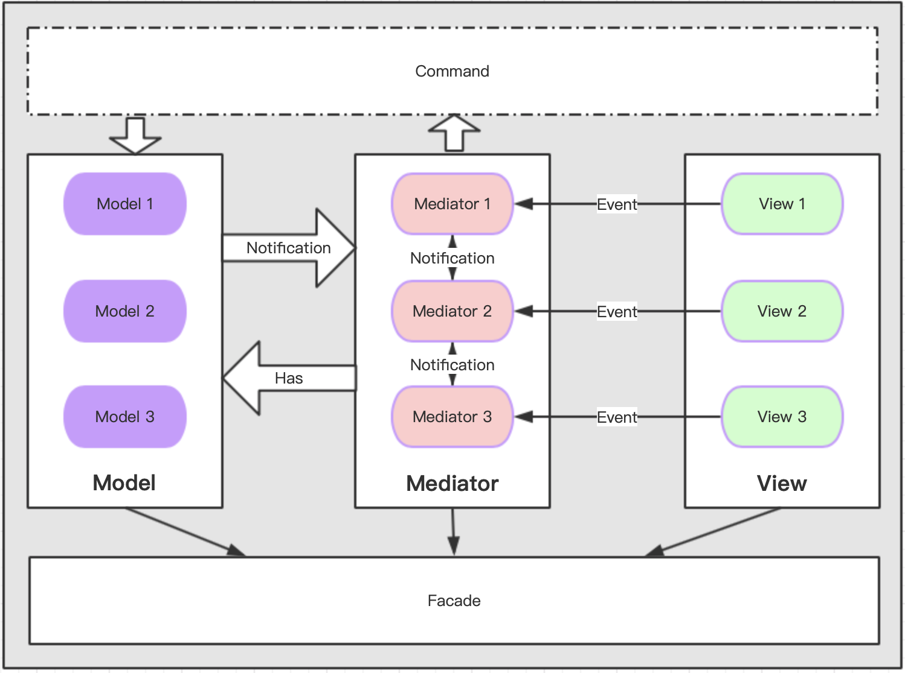

# lightMVC
framework for cocos creator 
---
简易轻量级MVC框架，适用于中小型项目使用。后续会拓展[lightMVC_ex](./lightMVC_ex/README.md)内容来适应大型项目的开发。这套轻量级MVC框架可以帮助开发者组织代码，以及业务结构，让项目更好维护和拓展，提高开发效率。examples目录下有完整的例子Demo。

#### 架构图

#### 节点功能
- Facade:全局控制类，持有对MVC各层的管理对象。原则上来说，除了初始化框架调用init和运行第一个场景外，都不应该引用和调用Facada中的任何接口和属性。该类是个全局的单例对象，包含几个重要的接口如下：
``` javascript
/**
 * 初始化框架配置
 * @param {boolean} debug 是否是调试状态
 * @param {cc.Size} designResolution 设计分辨率
 * @param {boolean} fitHeight 是否高适配
 * @param {boolean} fitWidth 是否宽适配
 */
public init(debug: boolean, designResolution: cc.Size, fitHeight: boolean, fitWidth: boolean): void;

/**
 * 运行场景
 * @param {{new(): BaseMediator}} mediator 场景mediator类型，类类型。
 * @param {{new(): BaseScene}} view 场景mediator类型，类类型。
 * @param {Object} data 自定义的任意类型透传数据。（可选）
 * @param {()=>void} cb 加载完成回调.
 */
public runScene(mediator: {new(): BaseMediator}, view: {new(): BaseScene}, data?: any, cb?: ()=>void): void;
```
- Model:数据对象，用于处理数据逻辑以及存储数据，常用来与服务器做数据交互，同时通过消息通知View层刷新显示。主要接口如下：
``` javascript
/** Model初始化时会调用的接口，可以用来初始化一些数据 */
public init(): void;
/**
 * 发送消息接口，当数据变化时需要调用此接口发送消息刷新View层。
 * @param {string} noti 消息名称
 * @param {Object} data 消息数据
 */
public sendNoti(noti: string, data?: any): void;
/** 清理接口，子类可以实现清理逻辑 */
public clear(): void;
```
- View:显示层，根据业务逻辑及数据显示，同时处理用户输入，通过事件与其他层交互。主要接口如下：
``` javascript
/** View创建时会被调用，子类可以重写 */
public init(): void;
/**
 * 发送UI事件，逻辑层接收事件处理逻辑。
 * @param {string} event 事件名称
 * @param {Object} body 事件参数
 */
public sendEvent(event: string, body?: any): void;
/** 关闭当前的界面 */
public closeView(): void;
/** 关闭所有弹出的界面 */
public closeAllPopView(): void;
/** 当界面被关闭时会被调用，子类可以重写该方法 */
public onClose(): void;
/** 子类覆盖，返回UI的prefab路径,默认是空节点 */
public static path(): string;
```
- Mediator:逻辑层中介者，负责接收Model层通知来刷新View层显示，同时还要接收View层事件来处理用户输入，并通过Command处理数据层数据。主要接口如下：
``` javascript
/**
 * 初始化接口,此时视图还没有创建，如果想操作视图view请在viewDidAppear函数中进行。
 * @param {Object} data 自定义的任意类型透传数据。（可选）
 * @override
 * */
public init(data?: any): void;
/**
 * 视图显示后会调用的接口
 * @override
 */
public viewDidAppear(): void;
/**
 * 绑定UI事件，接收view层派发的事件
 * @param {string} name 事件名称
 * @param {(any)=>void} cb 事件回调
 * @param {BaseMediator} target 回调绑定对象
 */
public bindEvent(name: string, cb: (body: any)=>void, target: BaseMediator): void;
/**
 * 注册消息监听
 * @param {string} noti 通知key值
 * @param {(data: any)=>void} cb 通知监听的回调函数
 * @param {Object} target 回调绑定的对象
 */
public registerNoti(noti: string, cb: (data: any)=>void, target: any): void;
/**
 * 发送消息通知
 * @param {string} noti 通知key值
 * @param {Object} body 消息传递的参数
 */
public sendNoti(noti: string, body: any): void;
/**
 * 发送命令接口
 * @param {{new (): BaseCommand}} cmd 命令类
 * @param {Object} data 命令参数
 */
public sendCmd<T extends BaseCommand>(cmd: {new (): T}, data?: any): void;
/**
 * 打开新场景
 * @param data {Object} data 自定义的任意类型透传数据。（可选）
 */
public runScene(mediator: {new(): BaseMediator}, view: {new(): BaseScene}, data?: any): void;
/**
 * 返回上一场景
 * @returns {boolean}是否存在上一个场景
 */
public backScene(): boolean;
/**
 * 打开view界面
 * @param {{new(): BaseMediator}} mediator 界面mediator类型，类类型。
 * @param {{new(): BaseView}} view view 场景mediator类型，类类型。
 * @param {Object} data 自定义的任意类型透传数据。（可选）
 */
public popView(mediator: {new(): BaseMediator}, view: {new(): BaseView}, data?: any): void;
/**
 * 添加层级
 * @param {{new(): BaseMediator}} mediator 界面mediator类型，类类型。
 * @param {{new(): BaseView}} view view 场景mediator类型，类类型。
 * @param {number} zOrder 层级。（可选）
 * @param {Object} data 自定义的任意类型透传数据。（可选）
 */
public addLayer(mediator: {new(): BaseMediator}, view: {new(): BaseView}, zOrder?: number, data?: any): void;
/** 获取model对象 */
public getModel<T extends BaseModel>(model: {new (): T}): T;
/** 销毁接口 */
public destroy(): void;
```

#### 使用方式
1. 初始化框架：
```javascript
// 调试模式为false、设计分辨率为1080*2048、宽适配。
Facade.getInstance().init(false, cc.size(1080, 2048), false, true);
```
2. 注册model数据对象：
```javascript
// 如果需要数据层，那么应该首先将所有需要的model在开始就都注册上。
Facade.getInstance().registerModel(PlayerModel);
```
3. 运行第一个场景：
```javascript
// 运行第一个场景时调用Facade的runScene接口，传入要运行的Mediator和Scene，还可选传入参数。
Facade.getInstance().runScene(DefaultSceneMediator, DefaultScene, "测试参数999");
```
4. 原则上说，除了上述三步需要引用Facade外，后面场景运行起来后就不需要再调用Facade了，在MVC的不同层级做对应的逻辑处理，父类接口都做了支持。
5. 场景运行后，可以在场景Mediator中创建层级view，或者pop出view。Layer view与pop view的区别就是，他们是两个管理器在进行管理，我们认为Layer是场景内初始化创建并且不会关闭的view界面，而pop view是可以随时打开或者关闭的view界面，当然具体怎么使用可以灵活处理。例如在DefaultSceneMediator中：
```javascript
/**
 * 创建一个常驻的view界面FirstView 
 * this.addLayer是BaseMediator中提供的基础功能接口（更多接口可以查看源码）。
 * 层级为1，并且传入参数：this._data
 * */
this.addLayer(FirstMediator, FirstView, 1, this._data);
```
6. View层的UI节点操作接口。在View里有个成员属性ui，该界面的UI节点会在初始化时自动初始化到这个成员属性上，在操作UI节点时可以通过这个属性进行操作，该属性类型是UIContainer，常用接口是getNode和getComponent，示例代码如下：
```javascript
// 获取node节点
let closeBtnNode = this.ui.getNode("close_btn");
closeBtnNode.on(cc.Node.EventType.TOUCH_END, this.closeAllView, this);
// 获取Component组件
let desLabel = this.ui.getComponent("des_label", cc.Label);
desLabel.string = "test";
```
7. View层与Mediator层的事件交互。Mediator直接持有View的引用，所以可以直接调用View中的接口，而View与Mediator就需要通过事件（Event）来进行交互了。首先需要在Mediator中注册监听：
```javascript
this.bindEvent(FirstView.OPEN_B, (str: string)=>{
    // todo something...
}, this);
```
然后在View中通过sendEvent接口发送事件来通知Mediator：
```javascript
// 第一个参数是事件名称，第二个参数是传递的参数。
this.sendEvent(FirstView.OPEN_B, "BBB");
```
8. Mediator操作Model数据。在Mediator中可以通过getModel接口获取到指定的Model对象，通过直接引用来读取Model中的数据。而在修改数据的时候有两种方式，一种是通过Model的引用直接进行修改，这种情况大多是比较简单直接修改某个数值等；另一种比较复杂，比如要获取多个Model的数据进行复杂的逻辑操作并且修改多个值的情况，这种就适合将逻辑封装到一个命令（Command）中，通过发送命令来处理数据，这样可以减少Mediator中逻辑复杂度和耦合度。例子如下：
```javascript
// 直接通过引用进行修改的情况
let playerModel = this.getModel(PlayerModel);
this.view.setLevelDisplay(playerModel.getPlayerLv());

// 通过命令进行操作的情况
this.sendCmd(UpdateExpCommand, exp);
```
9. Model数据修改通知View刷新逻辑。大多数情况下，Model用来处理纯数据逻辑和与服务器交互的数据接口，当数据有变化时我们希望通知View刷新显示，这是我们只能通过抛出消息通知来告诉Mediator，然后通过Mediator来修改View显示，首先需要在Mediator中注册消息通知：
```javascript
this.registerNoti(Notification.UPDATE_EXP_FINISH, ()=>{
    // todo something ...
}, this);
```
然后我们在Model中通过发送这个消息通知来告诉Mediator：
```javascript
// 该接口第二个参数可以传递参数
this.sendNoti(Notification.UPDATE_EXP_FINISH);
```
10. Mediator与Mediator之间的交互很简单，就是使用上面介绍Model向Mediator发送通知的方式。

#### 其他
简单的交互规则和接口调用介绍就这么多，还有就是代码结构的组织也很重要，这个就是看每个人或者项目的合理安排了，毕竟也是仁者见仁，智者见智的事情。**同时在examples目录下有完整的例子Demo**。

lightMVC目前仅适合中小型项目使用，过于复杂的大型项目可能应付起来就会有些吃力，不过后续会继续维护并拓展到[lightMVC_ex](./lightMVC_ex/README.md)中来支持大型项目开发，lightMVC会始终保持简单轻量。  

最后框架中有什么问题或者需要改进的问题欢迎反馈。
